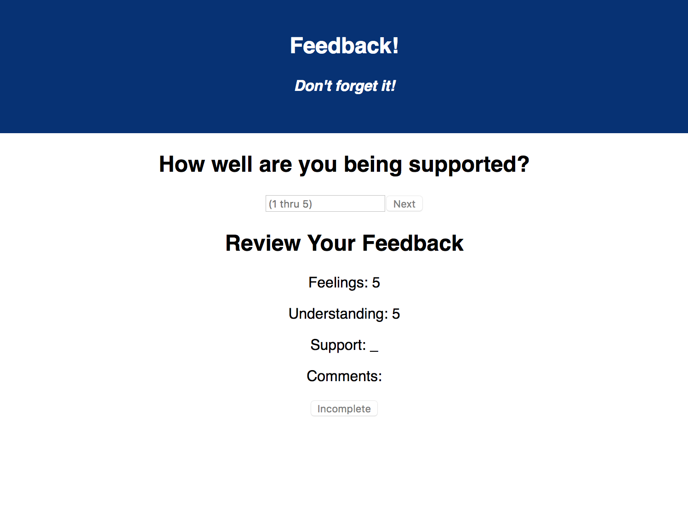

# Feedback Loop (Redux)
This is a daily student feedback form similar to the form used at [Prime Digital Academy](https://primeacademy.io/). This application features a multi-page submission process with the student answering one survey question per page. It relies heavily on [Redux](https://redux.js.org/) to keep all this data easily accessible from the submission page.

## Utilized Web Stack
- `User Interface` - [React](https://reactjs.org/)
- `Client` - React, [Redux](https://redux.js.org/) for conveniently sharing data across pages, [axios](https://www.npmjs.com/package/axios) for making HTTP requests to the server-side
- `Server` - [Node.js](https://nodejs.org/en/) and the [Express](https://expressjs.com/) framework for handling HTTP requests from the client-side
- `Database` - [PostgreSQL](https://www.postgresql.org/) via the Node.js library [pg](https://www.npmjs.com/package/pg)

## Getting Started
The following steps should get a copy of the project running on your local machine. See the deployment section for notes on how to deploy the project on a live system. I recommend using the program [`Homebrew`](https://brew.sh/) for installing any needed prerequisites, but I am sure other ways work as well.

### 1. Prerequisites
- [`Node.js`](https://nodejs.org/en/)
- [`npm`](https://www.npmjs.com/) should come included with `Node.js`
- [`PostgreSQL`](https://www.postgresql.org/)

```bash
# Using Homebrew...
brew update
brew install node
brew install postgresql
```

### 2. Installation
```bash
# 1. Clone or download this project
git clone https://github.com/mes32/feedback-loop-redux

# 2. Create a database name 'prime_feedback'
createdb prime_feedback

# 3. Create a table in 'prime_feedback' named 'feedback'
#    - See data.sql for details

# 4. Install node dependancies using NPM
npm install

# 5. Start the Node.js server (runs on port 5000)
npm run server

# 6. Start the React.js client-side development server (runs on port 3000)
npm run client
```

## Screen Shots

### Form Part 1
**http://localhost:3000/#/form-part-1**


### Form Part 2
**http://localhost:3000/#/form-part-2**


### Form Part 3
**http://localhost:3000/#/form-part-3**


### Form Part 4
**http://localhost:3000/#/form-part-4**


### Form Review
**http://localhost:3000/#/form-review**


### Form Confirmation
**http://localhost:3000/#/form-confirmation**


### Admin Page
**http://localhost:3000/#/admin**


## Documentation
This application started as my [Prime Academy](https://primeacademy.io/) Weekend Project #5. The original scope document (i.e. the assignment instructions) can be found here: [scope-document.md](./scope-document.md).

### Completed Features
- [x] Multi-page feedback submission form (until submitted client-side data is stored using Redux)
- [x] Submits student feedback to the server
- [x] Saves student feedback on the server-side database
- [x] Admin page shows history of all student feedback. Allows administrators to delete feedback entries from the database
- [x] Update this README.md to describe the project in my own words

### Next Steps
- [ ] Improve the styling of the app using Material-UI (theme, cards, snackbars, buttons, nav bar, and icons, etc)
- [ ] Ability to flag feedback entries for further review on the Administrator Page
- [ ] Deploy the application to Heroku

## Deployment
In the future I hope to deploy this to Heroku.

## Authors
* Michael Stockman

## Acknowledgments
* Anthony Dunahee ([adunahee](https://github.com/adunahee)) for helping me understand React Routers with more nuance.
* Sharmarke Duale ([sduale01](https://github.com/sduale01)) for helping me work through a particularly tricky React conditional rendering.
* Tiana Johnson ([TianaJohnson](https://github.com/TianaJohnson)) for pointing out that a particularly "tricky" conditional rendering didn't need to be so complicated, and I could achieve the same functionality with about half as many lines of code.
* My instructors at Prime: [Chris](https://github.com/christopher-black), [Ally](https://github.com/Lysautumn), and [Kris](https://github.com/kdszafranski).
